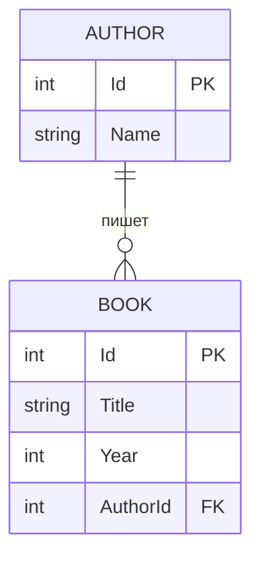
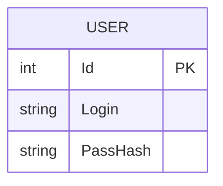

# Лабораторная работа №2

Тема: Интерфейсы. Репозиторий. JSON.

## Часть 1. Интерфейсы

Реализованы задания 1–4:
- **IMovable** — перемещение точки (`Point`).
- **IDrawable** — рисование (`Circle`, `Rectangle`, `DrawingService.DrawAll`).
- **IShare / I3DShare** — площадь, периметр, объём (`CircleShare`, `RectangleShare`, `Cube`).
- **ISP** — `IPrinter`, `IScanner`, `IFax`, класс `MultifunctionDevice`.
- **IPayable** — `CreditCard`, `Cash`, `PaymentProcessor.ProcessPayment`.
- **ILogger** — `ConsoleLogger`, `FileLogger`, `Worker.DoWork`.

### Контрольные вопросы

1. **Что такое интерфейс?** — Контракт, описывающий набор методов/свойств без реализации.
2. **Можно ли создать объект интерфейса напрямую?** — Нет, только через класс-реализацию.
3. **Зачем нужен полиморфизм интерфейсов?** — Единый способ работы с разными классами через один тип.
4. **Чем интерфейсы отличаются от абстрактных классов?** — Класс реализует много интерфейсов, но наследует один абстрактный класс; интерфейс не хранит состояние.
5. **Что такое ISP?** — Клиенты не должны зависеть от методов, которые не используют.
6. **Примеры из жизни.** — USB, розетка 220В, оплата картой/наличными, водительские права.

---

## Часть 2. Репозиторий

Файлы:
- `Part2_Models.cs` — сущности `Author`, `Book`.
- `Part2_Interfaces.cs` — `IRepository<T>`, `IBookRepository`, `IAuthorRepository`, `IUnitOfWork`.
- `Part2_Repository.cs` — in-memory реализации + Unit of Work.
- `Part2_Demo.cs` — демонстрация.

### ER-диаграмма

### Выводы о паттерне «Репозиторий»
- Отделяет бизнес-логику от слоя доступа к данным.
- Упрощает тестирование (легко подменить реализацию).
- Позволяет сменить СУБД без изменения бизнес-логики.
- В связке с **Unit of Work** координирует несколько репозиториев.

---

## Часть 3. REST API

См. отдельный репозиторий:  
[lab2-webapi](https://github.com/Muhammad050505/lab2-webapi)

- Таблица `User(Id, Login, PassHash)`.
- CRUD через JSON: `POST /user`, `GET /user/{id}`, `PUT /user/{id}`, `DELETE /user/{id}`.
- Хеширование пароля через BCrypt.
- Проверка уникальности логина.

### ER-диаграмма

---

## Автор
Muhammad050505
